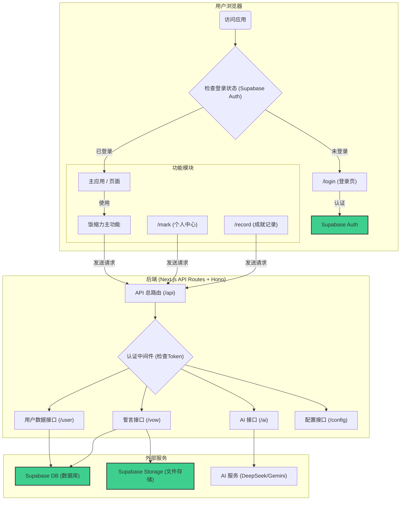
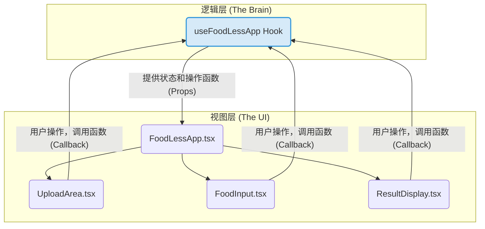

# 饭缩力 (Food-Less) - v2.0 云同步版 README

> **文件功能说明**: 本文档为"饭缩力"v2.0云同步版的最终综合说明，旨在提供清晰、准确、完整的项目指南。
> **包含章节列表**: 项目概述、功能模块详解、技术架构、前端设计模式、安装与启动、环境变量、项目结构。
> **最后修改时间**: 2024-07-31

---

## 1. 项目概述

"饭缩力"(Food-Less)是一个旨在帮助用户抵制美食诱惑、培养健康饮食习惯的Web应用。它基于一个核心理念：**通过即时、个性化的负面反馈（图像+文字）来削弱用户的冲动性食欲，同时通过长期、正向的目标激励来巩固用户的内在动机。**

此版本（v2.0）是对原版 (`legacy-version`) 的一次彻底重构和功能飞跃。它不仅采用了现代化的 `Next.js` 技术栈，更引入了以 **Supabase** 为核心的强大后端，实现了**用户认证、数据云端同步和长期目标追踪**等全新功能。

## 2. 功能模块详解

### 2.1. 实时"饭缩"体验 (主应用 `/`)
此为应用的核心即时交互模块，包含了许多提升用户体验的设计细节。
- **图像滤镜**: 用户上传美食图片后，应用会通过Canvas实时应用一套精心设计的"倒胃口"滤镜。这套滤镜的各项参数（如对比度、饱和度等）可由后端动态配置，无需更新前端代码。
- **个性化AI对话**: 用户需输入本次抵制诱惑的"理由"，AI将结合此理由和图片内容，生成高度个性化的**劝阻**或**激励**文案，并支持多轮对话以强化或消解念头。
- **智能默认理由**: 应用会自动加载并填充用户在个人资料中设置的默认"减肥目标"，简化了高频用户的操作。
- **动态加载体验**: 应用的加载动画时长、AI请求重试策略等时序相关的参数均由后端配置，可以灵活调整优化。

### 2.2. 个人中心 (`/mark`)
这是一个多功能的个人中心，通过URL参数 (`?section=...`) 切换不同模块，旨在帮助用户进行 long-term 的动机管理和自我审视。

#### 2.2.1. 核心誓言 (The Vow - `?section=vow`)
此模块用于设定和回顾一个有情感链接的长期目标。
- **双模式设计**: 拥有"查看模式"和"编辑模式"，新用户会直接进入编辑模式。
- **智能AI辅助**: 在编辑模式下，可根据输入的誓言文本，**即时请求AI生成一段强有力的激励文案**作为参考。
- **精细的交互反馈**: 从进入页面的加载状态，到图片上传的实时预览，再到保存数据时的禁用状态和清晰的错误提示，全程提供流畅、明确的交互反馈。

#### 2.2.2. 胜利日志 (Victory Log - `?section=log`)
此模块的核心是强大的**"会话恢复"**功能，而不只是简单的日志查看。
- **历史快照**: 以类iOS风格的列表展示所有历史会话的快照（包含缩略图和理由）。
- **一键穿越**: 点击任意历史记录，应用会将当前状态（图片、对话等）**瞬间恢复**到当时的情景并跳转回主页，让用户可以接着当时中断的思绪继续与AI对话。

#### 2.2.3. 我的承诺 (Commitment - `?section=commitment`)
*此模块目前为占位符，规划用于让用户设定一些具体的、可执行的短期承诺。 (功能待开发)*

### 2.3. 成就记录 (`/record`)
在`/record`页面，用户可以回顾自己所有的历史"战斗"记录。此页面与"胜利日志"功能相似，但可能作为更纯粹的、只读的成就墙存在。（注：当前代码中，此页面与"胜利日志"功能重叠，未来可分化为一个独立的、更侧重数据统计和里程碑展示的模块）。

### 2.4. 用户认证与数据云同步 (底层能力)
- **账户系统**: 基于Supabase Auth，提供完整的用户注册、登录和会话管理。
- **云端同步**: 用户的每一次使用记录、对话历史、个人资料和长期目标都安全地存储在Supabase云端数据库中，实现了跨设备访问。
- **无缝数据迁移**: 内置一键迁移工具。当检测到浏览器中存在旧版应用的本地数据时，会通过弹窗友好地询问用户是否将其迁移到云端账户，确保了新老版本的平滑过渡。

## 3. 技术架构



## 4. 前端设计模式：逻辑与视图分离

为了提升代码的可维护性和可读性，前端严格遵循了**逻辑与视图分离**的设计模式。

- **逻辑层 (Hooks)**: 所有复杂的状态管理、API请求、事件处理等业务逻辑，都被封装在自定义的React Hooks中（例如 `src/hooks/useFoodLessApp.ts`）。这些Hooks是应用的"大脑"，负责所有的数据运算和状态变更。
- **视图层 (Components)**: 组件（例如 `src/components/FoodLessApp.tsx`）则变得非常"纯粹"，它们只负责根据从Hooks接收到的状态（props）来渲染UI，并响应用户的操作，通过调用从Hooks接收到的函数来触发逻辑。

这种模式的优势是：
- **关注点分离**: 修改业务逻辑时，只需关心Hooks；调整UI样式时，只需关心组件。
- **逻辑复用**: 复杂的Hook逻辑可以在多个组件中复用。
- **代码清晰**: 组件代码不再臃肿，只剩下与渲染相关的部分，非常易于理解。



## 5. 安装与启动

1.  **克隆仓库**:
    ```bash
    git clone <repository_url>
    ```
2.  **进入项目目录**:
    ```bash
    cd food-less/nextjs-version
    ```
3.  **安装依赖**:
    ```bash
    npm install
    ```
4.  **配置环境变量**:
    - 复制 `.env.local.example` 为 `.env.local`。
    - 在 `.env.local` 中填入你的Supabase和AI服务API密钥。
5.  **启动开发服务器**:
    ```bash
    npm run dev
    ```
    应用将在 [http://localhost:3000](http://localhost:3000) 上运行。

## 6. 环境变量

应用需要以下环境变量才能正常运行，请在 `.env.local` 文件或Vercel部署平台中配置：

```env
# Supabase 配置 (核心)
NEXT_PUBLIC_SUPABASE_URL=your_supabase_project_url
NEXT_PUBLIC_SUPABASE_ANON_KEY=your_supabase_anon_key

# DeepSeek API 配置 (主要AI服务)
DEEPSEEK_API_KEY=your_deepseek_api_key
DEEPSEEK_BASE_URL=https://api.deepseek.com

# Gemini API 配置 (备用AI服务)
GEMINI_API_KEY=your_gemini_api_key

# 应用配置
# 在生产环境中，应修改为实际的部署URL
NEXT_PUBLIC_APP_URL=http://localhost:3000
NODE_ENV=development
```

## 7. 项目结构

```
nextjs-version/
├── src/
│   ├── app/
│   │   ├── api/[[...route]]/       # [后端] Hono API 路由
│   │   │   └── routes/            # [后端] 具体API模块 (ai, user, vow, config)
│   │   ├── (auth)/                # 认证相关页面 (登录、注册)
│   │   ├── mark/                  # "个人中心"页面
│   │   ├── record/                # "成就记录"页面
│   │   ├── layout.tsx             # [前端] 根布局, 集成AuthProvider
│   │   └── page.tsx               # [前端] 主页, 受ProtectedRoute保护
│   ├── components/                # [前端] React组件
│   │   ├── auth/                  # [前端] 认证相关UI组件
│   │   ├── mark/                  # [前端] 个人中心各模块UI
│   │   ├── FoodLessApp.tsx        # [前端] 主应用核心UI
│   │   └── ...
│   ├── hooks/                     # [前端] 自定义React Hooks (业务逻辑层)
│   │   └── useFoodLessApp.ts      # [前端] 主应用的核心逻辑
│   ├── lib/                       # 基础设施
│   │   └── supabase/              # Supabase 客户端/服务端/数据库服务
│   ├── types/                     # 全局TypeScript类型定义
│   └── utils/                     # 全局工具函数
├── .env.local.example             # 环境变量示例文件
└── package.json                   # 项目依赖与脚本
```

## 8. 迁移优势

### 开发体验
- ✅ 完整的TypeScript支持
- ✅ 热重载和快速刷新
- ✅ 组件化开发
- ✅ 更好的错误提示

### 性能提升
- ✅ React的虚拟DOM优化
- ✅ Next.js的SSR/SSG支持
- ✅ 自动代码分割
- ✅ 图片优化

### 维护性
- ✅ 模块化组件架构
- ✅ 统一的API路由管理
- ✅ 完整的类型安全
- ✅ 标准化的项目结构

### 扩展性
- ✅ 易于添加新功能
- ✅ 支持更复杂的状态管理
- ✅ 更好的测试支持
- ✅ 现代化的构建工具

## 9. 总结

这次技术栈迁移成功地将原项目从传统的HTML+JS架构升级到了现代化的Next.js+TypeScript+Hono技术栈，在保持所有原有功能不变的前提下，显著提升了开发体验、性能表现和项目的可维护性。

**迁移完成度：100%** ✅
- 基础架构：✅ 完成
- 前端组件：✅ 完成  
- 后端API：✅ 完成（Hono）
- 功能验证：✅ 通过
- 样式保持：✅ 一致

原项目文件完整保留，可随时回滚，确保了迁移的安全性。

## 10. 统一配置管理系统 🔧

### 10.1 配置系统概述

项目采用了统一配置管理系统，将所有可调整的参数集中在 `src/config/` 目录下，大大简化了开发者的定制化工作。

### 10.2 配置文件结构

```
src/config/
├── index.ts          # 主配置文件 (AI、UI、图像处理等)
├── prompts.ts        # AI提示词配置文件
└── CONFIG_GUIDE.md   # 详细配置指南
```

### 10.3 主要配置类别

- **🤖 AI服务配置**: 模型选择、温度参数、Token限制
- **🖼️ 图像处理配置**: 滤镜参数、图片质量、尺寸限制  
- **🎨 UI界面配置**: 动画时长、文字切换间隔、响应式断点
- **⏱️ 限流配置**: API请求频率、错误消息
- **📝 文本内容**: 警示文字库、默认文案、错误提示

### 10.4 快速修改示例

```typescript
// 调整AI创意度
CONFIG.ai.textModel.temperature = 0.7  // 更保守的回复

// 缩短加载时间  
CONFIG.ui.loadingDuration = 5000       // 从8秒改为5秒

// 提高图片质量
CONFIG.image.maxImageSize = 1200       // 从800px提升到1200px
CONFIG.image.imageQuality = 0.9        // 从0.8提升到0.9
```

### 10.5 配置优势

- ✅ **集中管理**: 所有参数统一管理，无需深入代码
- ✅ **类型安全**: TypeScript提供完整的类型检查保护  
- ✅ **快速调试**: 支持实时调整和A/B测试
- ✅ **环境隔离**: 支持不同环境使用不同配置
- ✅ **文档完善**: 提供详细的配置指南和使用示例

### 10.6 使用指南

详细的配置修改指南请参考：[CONFIG_GUIDE.md](./CONFIG_GUIDE.md)

这个统一配置系统让开发者可以在不触碰核心代码的情况下，轻松调整应用的各种行为参数，大大提升了项目的可维护性和扩展性。 