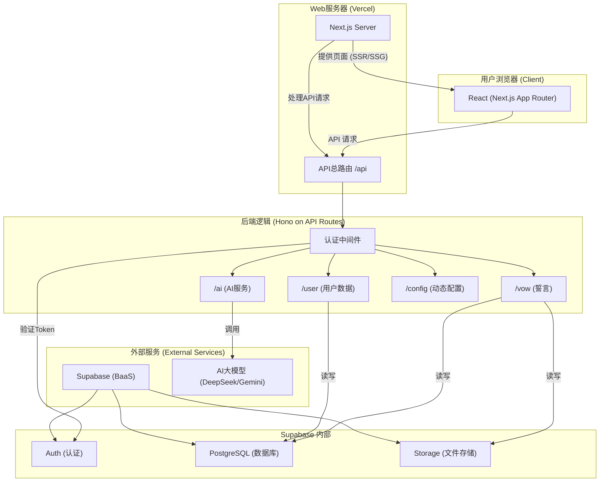

# 文档：02 - 技术架构

> **文件目标**: 解释系统各组成部分及其相互关系，提供项目的宏观技术地图。
> **最后更新**: 2024-07-31

## 1. 整体架构图

应用采用了经典的前后端分离架构，所有服务均构建在 Next.js 框架之上，并深度整合了 Supabase 作为后端即服务 (BaaS)。



## 2. 目录结构与职责

```
nextjs-version/
├── docs/                      # [文档] 项目的所有参考文档
├── src/
│   ├── app/
│   │   ├── api/[[...route]]/   # [后端] Hono API 路由定义
│   │   ├── (auth)/            # [前端] 认证相关页面 (登录、注册)
│   │   ├── mark/              # [前端] "个人中心"页面
│   │   ├── record/            # [前端] "成就记录"页面
│   │   ├── layout.tsx         # [前端] 应用根布局
│   │   └── page.tsx           # [前端] 应用主页
│   ├── components/            # [前端] 可复用的React组件 (视图层)
│   ├── hooks/                 # [前端] 自定义React Hooks (逻辑层)
│   ├── lib/                   # [通用] 基础库与服务集成
│   │   └── supabase/          # [通用] Supabase 客户端/服务端/数据库服务封装
│   ├── types/                 # [通用] 全局TypeScript类型定义
│   └── utils/                 # [通用] 全局工具函数
├── .env.local.example         # [配置] 环境变量示例
└── package.json               # [配置] 项目依赖与脚本
```

## 3. 关键技术选型

- **框架 - Next.js 14**: 利用其App Router实现现代化的React开发。同时承担Web服务器和后端API服务器的角色。
- **后端路由 - Hono**: 一个轻量、快速的Web框架，以中间件的形式运行在Next.js的API路由上，提供了比原生API路由更强大的路由组织和请求处理能力。
- **后端即服务 - Supabase**: 项目的"瑞士军刀"。
    - **Auth**: 处理用户认证、会话管理和行级安全策略（RLS）。
    - **Database**: PostgreSQL数据库，存储所有持久化数据（用户信息、会话、对话、誓言等）。
    - **Storage**: 存储用户上传的图片等文件。
- **前端状态管理**: 采用自定义React Hooks的方式，将组件逻辑抽离，实现了"逻辑"与"视图"的关注点分离，详见 `03-Frontend-Deep-Dive.md`。
- **样式 - Tailwind CSS**: 使用工具类优先的CSS框架，快速构建现代化UI。 