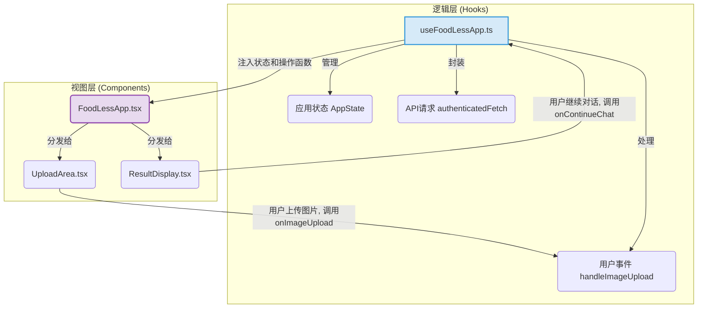

# 文档：03 - 前端深度解析

> **文件目标**: 详细解释前端的设计模式、状态管理和核心组件，帮助开发者快速上手前端代码。
> **最后更新**: 2024-07-31

## 1. 核心设计模式：逻辑与视图分离

为了提升代码的可维护性和可读性，前端严格遵循了**逻辑与视图分离**的设计模式。可以将其理解为一种前端的"MVVM"或"MVC"思想的变体。

- **逻辑层 (The Brain - Hooks)**: 位于 `src/hooks/`。所有复杂的状态管理、API请求、事件处理、数据加工等业务逻辑，都被封装在自定义的React Hooks中。这些Hooks是应用的"大脑"，负责所有的数据运算和状态变更，它们不关心UI长什么样。
- **视图层 (The UI - Components)**: 位于 `src/components/`。组件则变得非常"纯粹"和"无状态"，它们只负责根据从Hooks接收到的状态（props）来渲染UI，并响应用户的操作，通过调用从Hooks接收到的函数（callbacks）来触发逻辑。

这种模式的优势是：
- **关注点分离**: 修改业务逻辑时，只需关心`hooks`目录；调整UI样式时，只需关心`components`目录。
- **可测试性**: Hooks是纯粹的JavaScript逻辑，非常易于进行单元测试。
- **代码清晰**: 组件代码不再臃肿，只剩下与渲染相关的部分，非常易于理解和维护。

## 2. 状态管理核心：`useFoodLessApp.ts`

`src/hooks/useFoodLessApp.ts` 是整个应用前端的"中枢神经"。它几乎管理了主应用的所有状态和逻辑。

**主要职责**:
- **用户认证状态**: 通过 `useAuth()` Hook 获取当前登录的 `user` 和 `session`。
- **应用核心状态 `appState`**:
    - `currentStep`: 控制当前应显示哪个界面（'input', 'loading', 'result'）。
    - `isLoading`, `error`: 控制全局加载动画和错误提示。
    - `chatHistory`: 存储和管理当前的对话历史。
    - `uploadedImage`, `processedImage`, `weightLossReason`: 存储用户输入和处理结果。
- **持久化状态**: 通过自定义Hook `usePersistentState`，将 `appState` 自动同步到浏览器的 `localStorage`，实现了刷新页面状态不丢失的体验。
- **API交互**: 封装了 `authenticatedFetch` 函数，自动为需要认证的API请求附加 `Authorization` 头。
- **业务逻辑函数**:
    - `loadDynamicConfig`: 从后端加载动态配置。
    - `checkAndHandleMigration`: 处理旧数据的云端迁移。
    - `handleImageUpload`, `handleSubmit`: 处理用户的主要操作。
    - `processImage`: 调用Canvas API处理图像滤镜的核心算法。
    - `handleSendMessage`: 与AI后端进行对话交互。
- **暴露接口**: 最后，它返回一个包含了所有可供UI使用的状态和操作函数的对象。

## 3. 主要组件职责

- **`FoodLessApp.tsx` (主应用容器)**:
    - 调用 `useFoodLessApp()` Hook获取"引擎"。
    - 作为"交通警察"，根据 `appState.currentStep` 的值，条件性地渲染 `UploadArea`, `FoodInput` 或 `ResultDisplay`。
    - 将从Hook中获取的状态和函数，以props的形式分发给各个子组件。
- **`UploadArea.tsx` / `FoodInput.tsx` (输入组件)**:
    - 纯UI组件，接收props。
    - 响应用户操作（如选择文件、输入文字、点击按钮），并调用从props传来的回调函数（如 `onImageUpload`, `onSubmit`）。
- **`ResultDisplay.tsx` (结果展示组件)**:
    - 接收处理后的图片和对话历史并进行渲染。
    - 提供"继续对话"和"重置"的按钮，并绑定从props接收的相应回调函数。
- **`auth/AuthProvider.tsx`**:
    - 一个全局的上下文提供者 (Context Provider)，包裹在根布局 `layout.tsx` 中。
    - 负责监听Supabase的认证状态变化，并向整个应用提供全局的 `user` 和 `session` 信息。任何组件都可以通过 `useAuth()` Hook 方便地访问到这些信息。
- **`auth/ProtectedRoute.tsx`**:
    - 一个高阶组件 (HOC)，用于保护需要登录才能访问的页面。
    - 它会检查 `useAuth()` 提供的用户状态，如果用户未登录，则自动重定向到登录页面。 